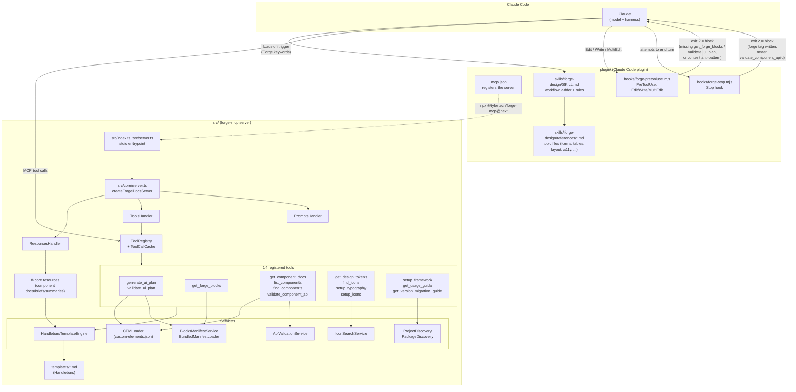
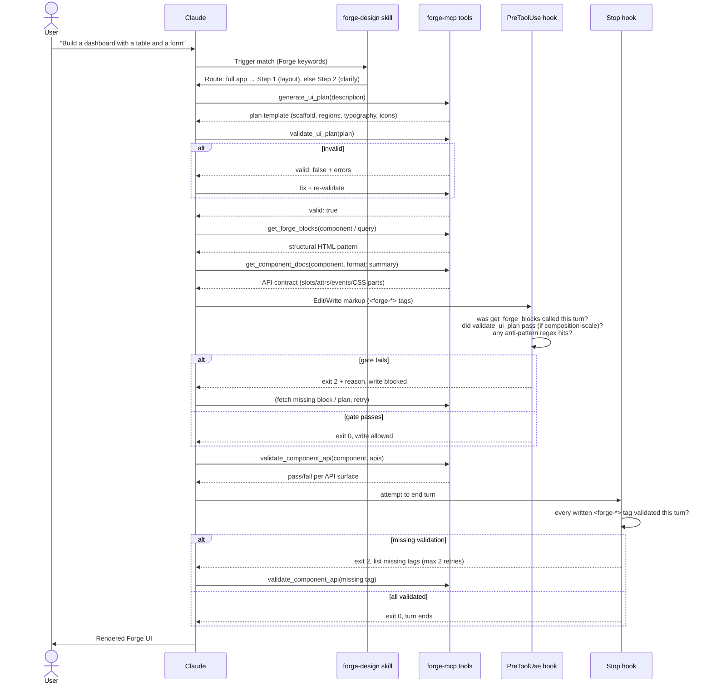

# Forge MCP — Architecture & Workflow

How the Claude Code plugin (skill + hooks) and the `forge-mcp` MCP server work together to ground Forge UI generation in real component/block data.

## 1. System map

Three moving parts, distributed across two packages:

- **`plugin/`** — the Claude Code plugin: registers the MCP server, ships the `forge-design` skill (routing/rules), and two enforcement hooks.
- **`src/`** — the `forge-mcp` MCP server itself: resources, tools, and the services/templates that back them.
- **Claude (the model)** — the consumer, driven by the skill's instructions and gated by the hooks.

## 2. Request flow — building Forge UI

The skill's numbered ladder (`SKILL.md` steps 0–7), showing where each hook intervenes.

## Key files

| Piece | Path |
|---|---|
| MCP server registration | `plugin/.mcp.json` |
| Skill (routing/rules) | `plugin/skills/forge-design/SKILL.md` |
| Skill reference files | `plugin/skills/forge-design/references/*.md` |
| Write-time gate | `plugin/hooks/forge-pretooluse.mjs` |
| Turn-end gate | `plugin/hooks/forge-stop.mjs` |
| Hook registration | `plugin/.claude-plugin/hooks.json` |
| Server entrypoint | `src/index.ts`, `src/server.ts` |
| Handler wiring | `src/core/server.ts` |
| Tool registry + cache | `src/tools/tool-registry.ts`, `src/services/tool-call-cache.ts` |
| Tool registration | `src/tools/index.ts` |
| Resource registration | `src/resources/index.ts` |
| Templates | `templates/**/*.md` |
